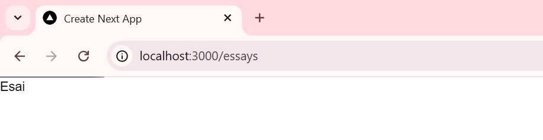
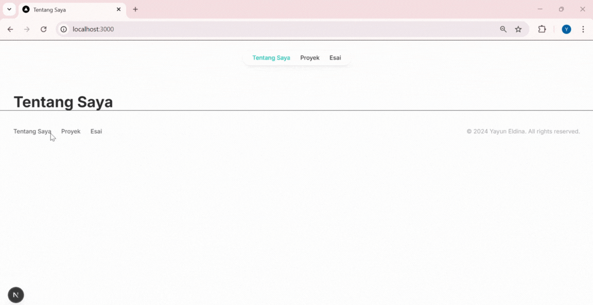

<table>
    <thead>
        <tr>
            <th style="text-align: center;" colspan="2">Pertemuan 4</th>
        </tr>
    </thead>
    <tbody>
        <tr>
            <td><strong>Nama :</strong></td>
            <td>Yayun Eldina</td>
        </tr>
        <tr>
            <td><strong>NIM :</strong></td>
            <td>2241720065</td>
        </tr>
    </tbody>
</table>

---

# **Jobsheet 4 - Membangun Website Pribadi dengan Next.js (App Router), React, dan Tailwind CSS**

## **Langkah-langkah Praktikum**

### **1. Persiapan Lingkungan**
1. Pastikan Node.js dan npm sudah terinstal di komputer Anda. Anda dapat memeriksanya dengan menjalankan perintah berikut di terminal atau command prompt: 
   ```sh
   node -v 
   npm -v 
   ```
   

2. Buat direktori baru untuk proyek Next.js Anda:
   ```sh
   mkdir website-pribadi 
   cd website-pribadi 
   ```
   

3. Inisialisasi proyek Next.js dengan TypeScript dan App Router:
   ```sh
   npx create-next-app@latest . --typescript --app 
   ```
   

   

4. Cek konfigurasi postcss.config.mjs:

   

5. Cek di app/globals.css, sudah ada import untuk tailwindcss:

   

6. Buka app/layout.tsx, tambahkan import './globals.css', dan modifikasi menjadi sebagai berikut:

   

   

7. Jalankan aplikasi Next.js:
   ```sh
   npm run dev 
   ```
   Aplikasi akan terbuka di browser pada alamat http://localhost:3000.

   

---

### **2. Membuat Halaman Website**
Website pribadi akan memiliki tiga halaman:
- **Tentang Saya**: Halaman berisi profil singkat dan link ke media sosial.
- **Proyek**: Halaman untuk menampilkan proyek-proyek yang telah diselesaikan.
- **Esai**: Halaman untuk menampilkan daftar artikel yang telah ditulis.

**Langkah-langkah:**
1. Buat file `app/page.tsx` sebagai halaman "Tentang Saya":

   

2. Buat file `app/projects/page.tsx` sebagai halaman "Proyek":

   

3. Buat file `app/essays/page.tsx` sebagai halaman "Esai":

   

4. Buka browser dan akses:
   - http://localhost:3000/ untuk halaman "Tentang Saya".
   - http://localhost:3000/projects untuk halaman "Proyek".
   - http://localhost:3000/essays untuk halaman "Esai".

   

   

   

---

### **3. Membuat Layout dan Navigasi**
Layout digunakan untuk menyediakan struktur yang konsisten di seluruh halaman, seperti navbar dan footer.

**Langkah-langkah:**
1. Buat direktori `src/components` jika belum ada.

2. Buat file `src/components/Layout.tsx`:

   

3. Buat file `src/components/Navbar.tsx`:

   

    

4. Buat file `src/components/Footer.tsx`

   

5. Update file `app/layout.tsx` untuk menggunakan layout:

   

6. Update setiap halaman menambahkan metadata dengan `generateMetadata`:

   

   

    

Hasil Implementasinya :



---

### **4. Membuat Halaman Proyek dengan Grid Responsif**
Halaman proyek akan menampilkan daftar proyek dalam bentuk grid yang responsif.

**Langkah-langkah:**
1. Buat folder di `public/images`. Kemudian tambahkan dua image, lalu rename dengan nama `project1.png` dan `project2.png`.
  
2. Modifikasi file `app/projects/page.tsx`:

   

    

3. Simpan file dan buka `http://localhost:3000/projects` di browser. Anda akan melihat daftar proyek dalam grid yang responsif.

   

---

## **Tugas**
1. **Modifikasi halaman "Esai" dengan Grid daftar artikel yang telah ditulis.**

   

Hasil Implementasi :


   
2. **Modifikasi halaman "Tentang Saya" Buat tampilan yang menarik**  

  


Hasil Implementasi :


---

## **Kesimpulan**
Dalam praktikum ini, Anda telah mempelajari cara membangun website pribadi menggunakan Next.js (App Router), React, dan Tailwind CSS. Anda juga telah mengimplementasikan fitur-fitur seperti routing, layout, serta komponen reusable.

